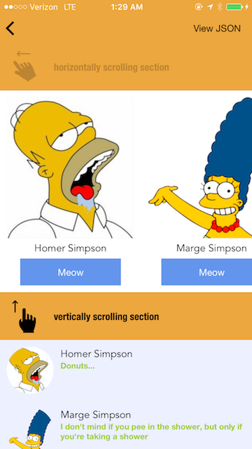
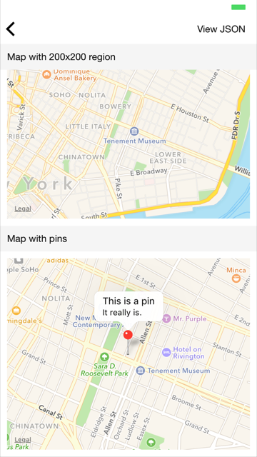
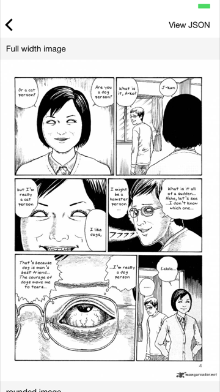
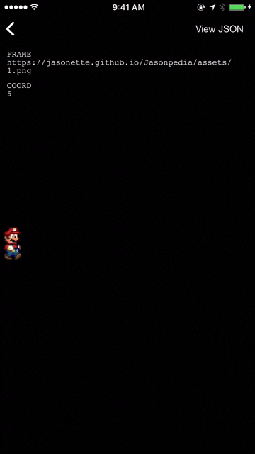

# What is this?
This repository is 99.9% JSON. And **THEY ARE ALL NATIVE iOS APPS**. When you play these JSON snippets on [Jasonette](https://www.jasonette.com), they instantly turn into native apps.

Here's how it works: Jasonette interprets the JSON markup into native iOS components. Just like how you use HTML to write a web page, you use JSON to write a native app.

Just like how web browsers deliver you completely different web pages depending on the URL, Jasonette delivers you completely different apps depending on the URL you add to it. And once you're done just publish to the appstore!

Check out [Jasonette](https://www.jasonette.com) to learn more.

Here are some highlights of what these JSON files can turn into (hint: anything you can imagine):

                  _                         |     _                                        
-------------------------------------------|--------------------------------------------
 [view/layer/dynamic.json](view/layer/dynamic.json)  |  [view/layer/weather/index.json](view/layer/weather/index.json)  
 [view/section/index.json](view/section/index.json)  |  [view/component/map/index.json](view/component/map/index.json)  
 [view/component/image.json](view/componenet/image.jason)  |  [view/layout/nested.json](view/layout.nested.json)  
 [action/timer/mario.json](action/timer/mario.json)        |                                            

# How to use this?

First of all, I recommend you check out the [website](https://www.jasonette.com) to quickly learn how this works.

## Recommended way
Jasonette ships with this repository's URL embedded by default, so if you just head over there and follow the "Get started" guide, you'll be able to try everything on this repository. (Note: The default root URL Jasonette ships with is [hello.json](https://github.com/Jasonette/Jasonpedia/blob/gh-pages/hello.json)).

## Manually
You can also manually add JSON to Jasonette. If you want to try adding each individual JSON file in this repository, you just need to add their published URLs to Jasonette and run. You can learn how to do that at [Getting started guide](https://jasonette.github.io/documentation).

Just remember, this repo uses [Github pages](https://pages.github.com) to publish the JSON, so all the files will be avaialbe under the `https://jasonette.github.io/Jasonpedia` base url.

For example the [hello.json](https://github.com/Jasonette/Jasonpedia/blob/gh-pages/hello.json) file in the root directory is directly available at [https://jasonette.github.io/Jasonpedia/hello.json](https://jasonette.github.io/Jasonpedia/hello.json), the [demo.json](https://github.com/Jasonette/Jasonpedia/blob/gh-pages/demo.json) is available at [https://jasonette.github.io/Jasonpedia/demo.json](https://jasonette.github.io/Jasonpedia/demo.json), and so forth.

# The purpose of this repo
This repo serves multiple purposes:

###1. Demo
This is the default JSON that ships with all Jasonette code, which means everyone who downloads Jasonette will get to play with what's in this repo as a starter project.

###2. Test
Whenever you write an [extension](https://jasonette.github.io/documentation/advanced/#extension) and want to share it with the rest of the community,  write a test JSON to make sure:
  - it works as intended
  - it plays nice with the rest of Jasonette
  - other people understand how to use it
  - the syntax is consistent with the convention

###3. Contribution
Contribution is encouraged for this repo. Feel free to share your JSON apps by sending pull requests.
