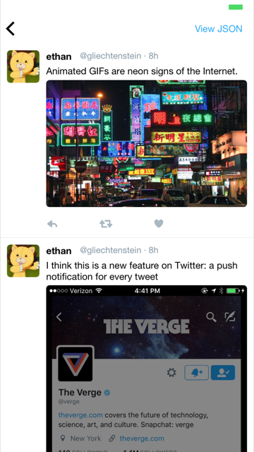

# What is this?
This repo consists 99% of JSON. And they are all **native iOS apps**. When you play these JSON snippets on [Jasonette](https://www.jasonette.com/beta), they instantly turn into a native apps. Check out [Jasonette](https://www.jasonette.com/beta) to learn more.

Here are some highlights of what these mere JSON files can turn into:

                                           |                                            |
-------------------------------------------|--------------------------------------------|---------------------------------------------
| | 
| | 
      |                                            |

# How does this work?
This repo publishes to `https://jasonette.github.io/Jasonpedia`.

For example the [hello.json](https://github.com/Jasonette/Jasonpedia/blob/gh-pages/hello.json) file in the root directory is directly available at [https://jasonette.github.io/Jasonpedia/hello.json](https://jasonette.github.io/Jasonpedia/hello.json).

So is every other file in this repo.

# How to use
The easiest way is to just download [Jasonette](https://www.jasonette.com/beta) and run. The `demo.json` URL is embedded in Jasonette by default, and it functions as the entry point for rest of the files in this repo.

# The purpose of this repo
This repo serves multiple purposes:

1. Demo: This is the default JSON that ships with all Jasonette code, which means everyone who downloads Jasonette will get to play with what's in this repo as a starter project.
2. Test: Whenever you write an [extension](https://jasonette.github.io/documentation/advanced/#extension) and would like to share it with the rest of the community,  write a test JSON to make sure:
  - it works as intended
  - it plays nice with the rest of Jasonette
  - the syntax is consistent with the convention
3. Participation: Participation is encouraged for this repo. Feel free to share your JSON by sending pull requests.
